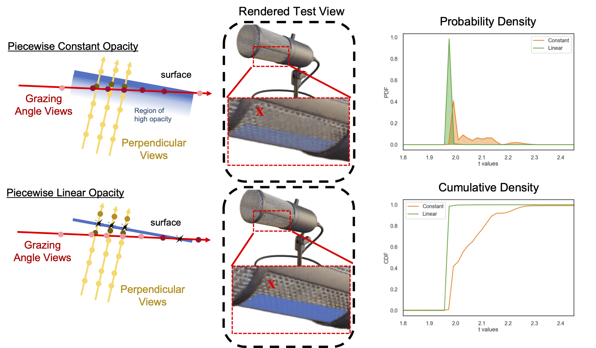

# PL-NeRF
**[NeRF Revisited: Fixing Quadrature Instability in Volume Rendering](https://pl-nerf.github.io)** 

Mikaela Angelina Uy, George Kiyohiro Nakayama, Guandao Yang, Rahul Krishna Thomas, Leonidas Guibas and Ke Li

Neurips 2023



## Introduction
Neural radiance fields (NeRF) rely on volume rendering to synthesize novel views. Volume rendering requires evaluating an integral along each ray, which is numerically approximated with a finite sum that corresponds to the exact integral along the ray under piecewise constant volume density. As a consequence, the rendered result is unstable w.r.t. the choice of samples along the ray, a phenomenon that we dub **quadrature instability**. We propose a mathematically principled solution by reformulating the sample-based rendering equation so that it corresponds to the exact integral under **piecewise linear** volume density. This simultaneously resolves multiple issues: conflicts between samples along different rays, imprecise hierarchical sampling, and non-differentiability of quantiles of ray termination distances w.r.t. model parameters. We demonstrate several benefits over the classical sample-based rendering equation, such as sharper textures, better geometric reconstruction, and stronger depth supervision. Our proposed formulation can be also be used as a drop-in replacement to the volume rendering equation of existing NeRF-based methods.

```
@inproceedings{uy-plnerf-neurips23,
      title = {NeRF Revisited: Fixing Quadrature Instability in Volume Rendering},
      author = {Mikaela Angelina Uy and George Kiyohiro Nakayama and Guandao Yang and Rahul Krishna Thomas and Leonidas Guibas and Ke Li},
      booktitle = {Advances in Neural Information Processing Systems (NeurIPS)},
      year = {2023}
      }
```

## Set-up
### Data
```
mkdir data
```
Download the following data into this folder:
- Original hemisphere data for the Blender scenes [here](https://drive.google.com/file/d/18JxhpWD-4ZmuFKLzKlAw-w5PpzZxXOcG/view?usp=share_link).
- Our processed blender scenes rendered at different fixed camera distances (for eval) are found [here]().
- - Our processed blender scenes rendered at different random camera distances (for multi-distance training) are found [here]().

### Environment
This was tested with CUDA 11.3 using an NVIDIA V100, A5000 and RTX GPUs.
```
conda env create -f environment.yml
```

## Code
### Novel View Synthesis Experiments

Piecewise Linear:
```
python run_plnerf.py --task train --config configs/blender_linear.txt --data_dir data/ --ckpt_dir logs_blender_hemisphere --scene_id chair --expname chair --white_bkgd --eval_data_dir /orion/u/mikacuy/coordinate_mvs/piecewise_linear/nerf_synthetic/fixed_dist_new-rgba --eval_scene_id chair_rgba_fixdist_nv100_dist0.25-1.0-4_depth_sfn --set_near_plane=0.5
```


Vanilla Constant:
```
python run_nerf_vanilla.py --task train --config configs/blender_constant.txt --data_dir data/ --ckpt_dir logs_blender_hemisphere --scene_id chair --expname chair --white_bkgd --eval_data_dir /orion/u/mikacuy/coordinate_mvs/piecewise_linear/nerf_synthetic/fixed_dist_new-rgba --eval_scene_id chair_rgba_fixdist_nv100_dist0.25-1.0-4_depth_sfn --set_near_plane=0.5
```

### Sample-based Depth Experiments

Depth:
```
### Piecewise Linear
python3 run_nerf_sample_based_depth.py train --scene_id chair_rgba_randdist_nv100_dist0.5-1.0_depth_sfn --data_dir /orion/u/mikacuy/coordinate_mvs/piecewise_linear/nerf_synthetic/randdist-0.5_1.0-rgba --dataset blender2_depth --ckpt_dir log_depth --expname=chair_linear --N_samples=128 --N_importance=64 --mode=linear

### Piecewise Constant
python3 run_nerf_sample_based_depth.py train --scene_id chair_rgba_randdist_nv100_dist0.5-1.0_depth_sfn --data_dir /orion/u/mikacuy/coordinate_mvs/piecewise_linear/nerf_synthetic/randdist-0.5_1.0-rgba --dataset blender2_depth --ckpt_dir log_depth --expname=chair_constant --N_samples=64 --N_importance=128 --mode=constant
```

## Related Work
This work and codebase is related to the following previous works:
* <a href="https://github.com/yenchenlin/nerf-pytorch" target="_blank">NeRF-Pytorch</a> by Yen-Chen Lin. (2020).
* <a href="https://github.com/mikacuy/scade" target="_blank">SCADE: NeRFs from Space Carving with Ambiguity-Aware Depth Estimates</a> by Uy et al. (CVPR 2023).

## License
This repository is released under MIT License (see LICENSE file for details).
